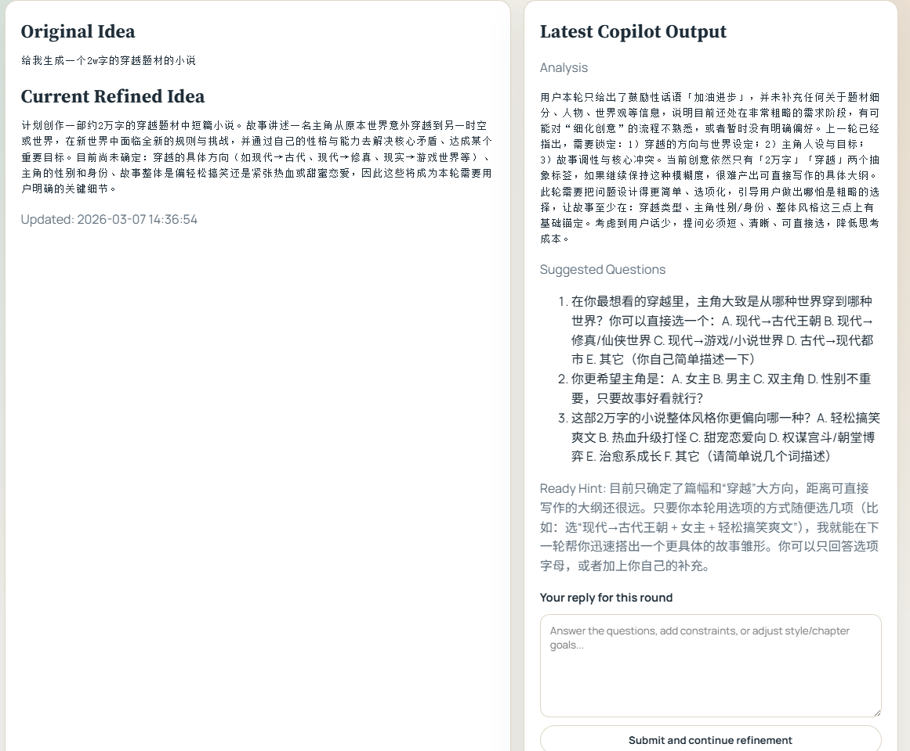

# CoLong Idea Studio

<div align="center">

**面向长篇创作的协同式 Agent 写作框架：先共创想法，再分章生成，并用动态记忆维持一致性。**

[在线体验](https://colong-idea-studio.cloud) | [项目展示页](https://xiao-zi-chen.github.io/CoLong-Idea-Studio/) | [English README](README.md) | [本地 Web 启动说明](RUN_LOCAL_WEB.md)


</div>

`CoLong Idea Studio` 不是“给我一个题材，直接一口气写完”的一次性生成器。它更像一个用于长篇创作的协作系统：先帮你把创意补完整，再生成全局大纲和章节计划，然后把章节摘要、人物设定、世界观设定、事实卡片等内容持续写回动态记忆，在后续章节继续取回使用。

如果你在意长篇小说里的连续性、设定不漂移、章节间前后呼应，以及生成过程是否可观察，这个项目比普通长文本生成方式更合适。

## 为什么它值得被关注

| 常见长文本生成方式 | CoLong Idea Studio |
|---|---|
| 从一个很模糊的想法直接开始写 | 先通过 `Idea Copilot` 反复追问，把想法补完整 |
| 上下文主要靠一次 prompt | 会把大纲、摘要、设定、事实持续写回动态记忆 |
| 后面章节容易人设漂移、设定打架 | 用类型化记忆回注，维持人物、世界观、情节承诺的一致性 |
| 跑起来像黑箱，很难知道系统做了什么 | 运行中可查看 `progress.log`、章节文件和记忆索引 |

## 界面预览

<p align="center">
  
  
</p>

## 你可以用它做什么

- 在正式写作前，用协同式 `Idea Copilot` 把模糊创意补成更稳定的写作 brief。
- 生成按章节推进的长篇小说或连续故事。
- 在运行时查看大纲生成、章节规划、章节长度目标、记忆写回等过程信号。
- 通过 CLI 或本地多用户 Web 门户使用整套流程。
- 为每次运行单独隔离动态记忆，便于复现实验和排查问题。

## 特别适合这些场景

- 长篇小说、连载故事、章节化叙事
- 世界观复杂、角色较多的创作项目
- 人机协同创作流程
- 动态记忆 / Agent 写作 / 长文本一致性相关实验

## 快速开始

### 方案 A：本地 Web 门户

Windows 下推荐这样启动：

```powershell
python -m venv .venv
.\.venv\Scripts\Activate.ps1
python -m pip install --upgrade pip setuptools wheel
python -m pip install -r requirements.txt
python -m pip install -r local_web_portal\requirements.txt
.\start_local.ps1
```

启动后访问：

```text
http://127.0.0.1:8010
```

为什么推荐这个入口：

- 会先检查 Python 版本是否满足 `3.10+`
- 会先验证 `local_web_portal.app.main:app` 是否能正常导入
- 能避免全局 Python 或全局 `uvicorn` 用错导致的启动问题
- 本地启动时默认关闭 embedding 下载，体验更稳定

可选参数：

```powershell
.\start_local.ps1 -BindHost 0.0.0.0 -Port 8010
.\start_local.ps1 -Reload
```

### 方案 B：CLI

运行前，先在项目根目录配置 `.env`，或直接写入环境变量：

```text
LLM_API_KEY=your_api_key
LLM_PROVIDER=deepseek
MODEL_NAME=deepseek-chat
```

也兼容这些 API Key 变量名：

- `DEEPSEEK_API_KEY`
- `OPENAI_API_KEY`
- `CODEX_API_KEY`

然后执行：

```powershell
python -m venv .venv
.\.venv\Scripts\Activate.ps1
python -m pip install --upgrade pip
python -m pip install -r requirements.txt
python main.py
```

## 它是怎么工作的

1. 用户先提供一个题材、设定、主题或剧情种子。
2. `Idea Copilot Agent` 持续追问，直到创意足够清晰，可以进入正式写作。
3. 系统生成全局大纲和章节级计划。
4. 写每一章时，会把最近摘要、事实卡片、大纲、人物设定、世界观设定等组合成动态记忆上下文。
5. 新章节的摘要和事实又会写回记忆，供后续章节继续使用。
6. 运行过程中会落盘日志和章节文件，让整个过程可检查、可追踪。

## 核心能力

- `协同式创意完善`：不是表单问答，而是真正的 Agent 追问循环。
- `动态记忆优先`：相比静态知识库，更强调写作过程中的记忆写回与再利用。
- `类型化记忆装配`：人物、世界观、大纲、事实卡片会按类型组织后再注入 prompt。
- `可观测进度日志`：可以看到大纲、计划、长度目标、记忆快照、章节推进等中间状态。

## 关键运行产物

调试和理解系统时，最值得看的文件通常是：

```text
runs/<run_id>/progress.log
runs/<run_id>/output.txt
runs/<run_id>/chapters/
vector_db/memory/run_<run_id>/memory_index.json
```

`progress.log` 里的典型事件包括：

| 事件 | 含义 |
|---|---|
| `global_outline` | 全局大纲已落盘 |
| `chapter_outline_ready` | 章节大纲已准备完成 |
| `chapter_plan` | 当前章节写作计划 |
| `chapter_length_plan` | 当前章节目标长度及其推断来源 |
| `memory_snapshot` | 动态记忆快照 |
| `character_setting` / `world_setting` | 人物或世界观设定写回记忆 |

## 系统流程图


整体流程是一个闭环：规划、写作、检索、存储、回注。这样后续章节会持续受到前文已形成设定和叙事承诺的约束，而不是越写越散。

## 仓库结构

```text
.
|-- agents/                # 写作、检索、协同创意相关 Agent
|-- workflow/              # analyzer / organizer / executor
|-- rag/                   # 动态记忆与检索逻辑
|-- utils/                 # LLM 客户端与通用工具
|-- local_web_portal/      # 本地多用户 FastAPI 门户
|-- docs/                  # 图示、截图与项目页素材
|-- config.py              # 配置中心
`-- main.py                # CLI 入口
```

## 部署建议

- 部署时优先上传源码和必要文档，不要把历史运行产物一起带上去。
- `runs/*`、`vector_db/*`、`.venv/*`、`__pycache__/*` 这类内容建议排除。
- API Key 和密钥类配置应放在真实部署环境中，不要直接提交到仓库。
- 如果对公网开放 Web 门户，建议放在 HTTPS 和反向代理之后。

更细的运维说明可参考 [DEPLOY_WHITELIST.md](DEPLOY_WHITELIST.md) 和 [RUN_LOCAL_WEB.md](RUN_LOCAL_WEB.md)。

## 更多文档

- 英文 README: [README.md](README.md)
- 学术展示页: [xiao-zi-chen.github.io/CoLong-Idea-Studio](https://xiao-zi-chen.github.io/CoLong-Idea-Studio/)
- 本地门户启动说明: [RUN_LOCAL_WEB.md](RUN_LOCAL_WEB.md)

## 引用

```bibtex
@software{colong_idea_studio_2026,
  title        = {CoLong Idea Studio: A Dynamic-Memory-First Collaborative Agent Framework for Long-Form Creative Ideation and Story Generation},
  author       = {xiao-zi-chen and contributors},
  year         = {2026},
  url          = {https://github.com/HITSZ-DS/CoLong-Idea-Studio}
}
```
